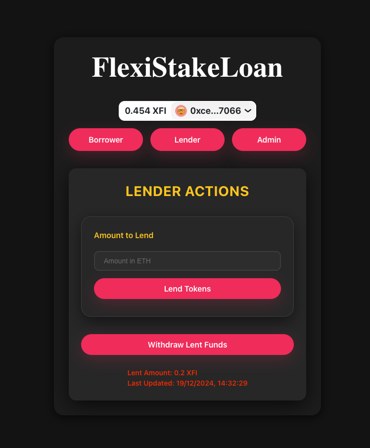

# FlexiSTakeLoan

## Project Front Page

Here is a preview of the project's front page:

---

## Introduction
FlexiSTakeLoan is a decentralized finance (DeFi) smart contract enabling users to stake native tokens, borrow funds against their staked tokens, lend tokens for rewards, and manage loan repayments. The contract also handles defaults by forfeiting staked tokens and blacklisting borrowers.

---

## Features
- **Staking:** Users can stake native tokens to earn compounding rewards.
- **Borrowing:** Borrow against staked tokens with flexible loan durations (30, 90, or 180 days).
- **Lending:** Provide liquidity to the contract and earn compounding rewards.
- **Loan Repayment:** Repay borrowed amounts with interest and reclaim staked collateral.
- **Default Handling:** Automatic forfeiture of staked tokens for overdue loans, with borrower blacklisting.
- **Rewards:** Both stakers and lenders earn monthly compounding interest and annual bonuses.
- **Admin Control:** Owners can handle loan defaults and manage blacklisted users.

---

## Contract Details
### Staking
- Stake native tokens to earn rewards.
- Rewards accrue monthly (3% compounding) and annually (10% bonus).

### Borrowing
- Borrow up to 50% of staked collateral.
- Loan durations available:
  - **30 days** (5% monthly interest).
  - **90 days** (7% monthly interest).
  - **180 days** (10% monthly interest).

### Lending
- Lenders can deposit funds into the contract to earn rewards.
- Rewards accrue at 3% monthly compounding and 10% annually.

### Loan Default
- Borrowers default if loans remain unpaid past their duration.
- Default consequences:
  - Forfeiture of staked tokens.
  - Blacklisting of the borrower.

### Admin Functions
- Handle loan defaults.
- Remove users from the blacklist.

---

## Contract Variables
- **Interest Rates:**
  - Staking: 3% monthly, 10% annual bonus.
  - Borrowing: 5%-10% monthly (depending on loan duration).
- **Limits:**
  - Max Staked Amount: `1,000,000` tokens.
  - Max Borrowed Amount: `500,000` tokens.
- **Events:** Tracks activities such as staking, borrowing, repayment, and rewards.

---

## Functions Overview
### Borrower Functions
- **stakeTokens():** Stake native tokens to earn rewards.
- **borrowTokens(uint256 _amount, LoanDuration duration):** Borrow against staked tokens.
- **repayBorrowedTokens():** Repay loan with interest and reclaim collateral.

### Lender Functions
- **lendTokens():** Lend tokens to the contract.
- **withdrawLentFunds():** Withdraw lent funds along with rewards.

### Admin Functions
- **handleLoanDefault(address _borrower):** Forfeit staked tokens and blacklist defaulting borrowers.
- **removeFromBlacklist(address _user):** Remove users from the blacklist.

---

## Usage Instructions
1. **Deploy the Contract:**
   - Deploy the `StakeToLoan` contract on a supported blockchain.

2. **Stake Tokens:**
   - Call `stakeTokens()` with the desired amount.

3. **Borrow Tokens:**
   - Call `borrowTokens()` with the loan amount and duration.

4. **Repay Loans:**
   - Use `repayBorrowedTokens()` to clear debt and reclaim collateral.

5. **Lend Tokens:**
   - Use `lendTokens()` to provide liquidity and earn rewards.

6. **Withdraw Lending Rewards:**
   - Call `withdrawLentFunds()` to claim rewards and principal.

7. **Handle Defaults (Admin Only):**
   - Call `handleLoanDefault()` for overdue loans.

---

## Events
- **Staked(address indexed user, uint256 amount):** Triggered when a user stakes tokens.
- **Borrowed(address indexed user, uint256 amount, uint256 duration):** Triggered when a user borrows tokens.
- **RepaymentMade(address indexed user, uint256 amount):** Triggered when a user repays a loan.
- **Withdrawn(address indexed user, uint256 amount):** Triggered when a lender withdraws funds.
- **RewardsClaimed(address indexed user, uint256 amount):** Triggered when staking rewards are claimed.
- **Lent(address indexed user, uint256 amount):** Triggered when a user lends tokens.
- **LenderRewardsClaimed(address indexed user, uint256 amount):** Triggered when lending rewards are claimed.
- **LoanDefaulted(address indexed borrower, uint256 forfeitedAmount):** Triggered when a borrower defaults on a loan.

---

## Security Considerations
- Ensure the contract is audited before deployment.
- Only stake what you can afford to lose.
- Monitor loan durations to avoid defaults.

---

## License
- This project is licensed under the MIT License. See the LICENSE file for more details.

---

## Support

For any inquiries or support, please open an issue on the GitHub repository or contact us via email.

## Links

- **GitHub Repository**: [https://flexi-stake-loan.vercel.app/](https://flexi-stake-loan.vercel.app/)
- **Demo Video**: [Watch here](#)
- **Project Website**: [https://github.com/Anish99594/FlexiStakeLoan](https://github.com/Anish99594/FlexiStakeLoan)

